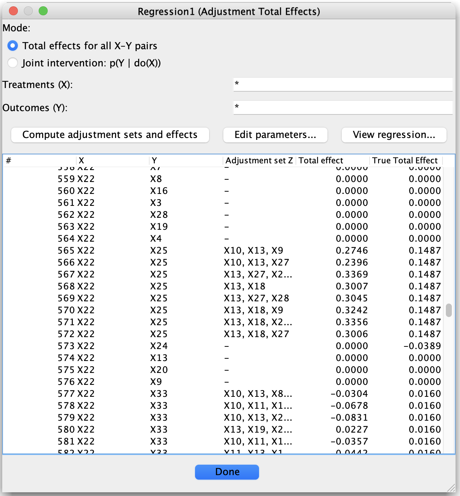

# Detail: Adjustment and Total Effects: Amenability and Discrete Variables

This page documents how the **Adjustment and Total Effects** tool reports results, with particular emphasis on
**amenability** and the handling of **discrete variables**.

The goal of the tool is to compute a *well-defined total causal effect* when such an effect is identifiable from the graph and data,
and to clearly indicate when it is not.

---

## What Is an Amenable Pair?

A treatment–outcome pair \((X, Y)\) is said to be **amenable** if a *specific total causal effect* of \(X\) on \(Y\) can be identified
from the given causal graph using adjustment.

This notion is formalized in the **Generalized Adjustment Criterion (GAC)** of:

> **Perković, D., Kalisch, M., Maathuis, M. H., & Bühlmann, P. (2018).**  
> *Complete graphical characterization and construction of adjustment sets in Markov equivalence classes of ancestral graphs.*  
> Journal of Machine Learning Research, 18(220), 1–62.

Intuitively, amenability ensures that adjustment recovers a *single, well-defined total effect*, rather than a *set of possible effects*
(as in methods such as IDA).

---

## Amenability via Visible Edges

According to the GAC, a pair \((X, Y)\) is **amenable** if **every potentially directed path from \(X\) to \(Y\)** starts with a
**visible edge out of \(X\)**.

- A *potentially directed path* is a path that could be oriented as a directed path from \(X\) to \(Y\) in at least one graph
  consistent with the equivalence class.

- A *visible edge* is an edge whose orientation is not confounded by latent variables.

### DAGs, CPDAGs, and MAGs

For the following graph types:

- **DAGs**
- **CPDAGs**
- **MAGs**

an edge is **visible if and only if it is directed**.

Thus, in these graphs, amenability reduces to the requirement that every potentially causal path from \(X\) to \(Y\)
begins with a directed edge \(X \to \cdot\).

### PAGs and Graphs with Circle Endpoints

For **PAGs** (and other graphs with circle endpoints), edge visibility is more subtle.
The formal definition of visibility is given in:

> **Zhang, J. (2008).**  
> *On the completeness of orientation rules for causal discovery in the presence of latent confounders and selection bias.*  
> Artificial Intelligence, 172(16–17), 1873–1896.

Roughly speaking, an edge in a PAG is **visible** if its orientation cannot be explained away by latent confounding.
The Adjustment tool uses this formal notion of visibility when assessing amenability in PAGs.

---

## How Amenability Is Reported in the Tool

- If a pair \((X, Y)\) is **not amenable**, the results table explicitly reports that the pair is *not amenable*.
- In this case, **no regression is performed**, and **no total effect is reported**, since a unique total effect is not identifiable.

This behavior avoids silently reporting ambiguous or misleading estimates.

---

## Discrete Variables and Regression Output

Even when a pair \((X, Y)\) is amenable, regression-based effect estimation may still be inappropriate if discrete variables are involved.

The tool therefore distinguishes two cases:

### Default Behavior

- If an amenable adjustment involves **any discrete variable**
  (in the treatment, outcome, or adjustment set),
  the **Total Effect** column reports **“Discrete”**.
- No numeric effect is shown.

### Optional Approximation

- If the user explicitly enables  
  **“Treat discrete variables as continuous”** in the parameters dialog,
  the tool will compute and report a numeric effect using linear regression.

This opt-in requirement is intentional: treating discrete variables as continuous is an approximation whose validity depends on context,
and should be made consciously by the user.

---

## Amenability and Refining Equivalence Classes

In some cases, a treatment–outcome pair ⟨X, Y⟩ is **not amenable** in the graph returned by causal discovery, meaning that a unique total effect cannot be identified under the Generalized Adjustment Criterion (GAC).

This does *not* necessarily mean that the total effect is fundamentally unidentifiable. Instead, it may indicate that the **current equivalence class is too coarse** to support identification.

---

### CPDAGs, Background Knowledge, and maxPDAGs

For **CPDAGs**, non-amenability can sometimes be resolved by incorporating additional background knowledge that orients some of the previously undirected edges. When such orientations are added and the resulting graph is closed under **Meek’s orientation rules**, the result is a **maximally oriented PDAG (maxPDAG)**.

Amenability is then assessed **with respect to this refined graph**, not the original CPDAG.

This is consistent with the theory in Perković et al. (2018): identifying a unique total effect requires ruling out DAGs in the equivalence class that disagree about the causal direction of edges along potentially directed paths from X to Y. Refining a CPDAG to a maxPDAG achieves exactly this kind of restriction.

---

### PAGs: Caution and Current Status

For **PAGs**, which represent equivalence classes of MAGs, the situation is more subtle.

Perković et al. establish amenability and the Generalized Adjustment Criterion for PAGs *as equivalence-class objects*. However, unlike the CPDAG case, it is **not currently established** that arbitrarily refining a PAG by orienting additional edges (and closing under the standard FCI rules) always yields a valid basis for reassessing amenability.

There is active research on how background knowledge can be incorporated into PAGs and how orientations propagate in a sound and complete way. In particular, later work by Perković and collaborators studies principled orientation procedures for PAGs under background knowledge, but these results go beyond the original GAC paper.

As a result, for PAGs it is safest to state:

- Amenability is defined **with respect to the PAG itself**, as returned by causal discovery under the stated assumptions.
- Whether and how amenability can be recovered by refining a PAG using additional orientation information depends on further theoretical guarantees.
- One should avoid interpreting arbitrary partially oriented PAGs as valid inputs for total effect identification unless they are known to correspond to a sound refinement of the underlying equivalence class.

---

### Practical Interpretation

- For **CPDAGs**, refining the graph via background knowledge to a **maxPDAG** is a well-founded way to potentially restore amenability.
- For **PAGs**, amenability should be assessed conservatively, unless a refinement procedure with theoretical justification is being used.

This distinction reflects current theory and avoids overstating what is known for PAGs, while remaining consistent with the Generalized Adjustment Criterion framework.

---

## Summary

- **Amenability** determines whether a *unique total effect* can be identified.
- Amenability is assessed using the **Generalized Adjustment Criterion**.
- For PAGs, edge visibility follows the formal definition of Zhang (2008).
- Non-amenable pairs are reported explicitly.
- Discrete variables are handled conservatively unless the user opts in.

These design choices aim to make total-effect reporting **explicit, principled, and difficult to misuse**.
