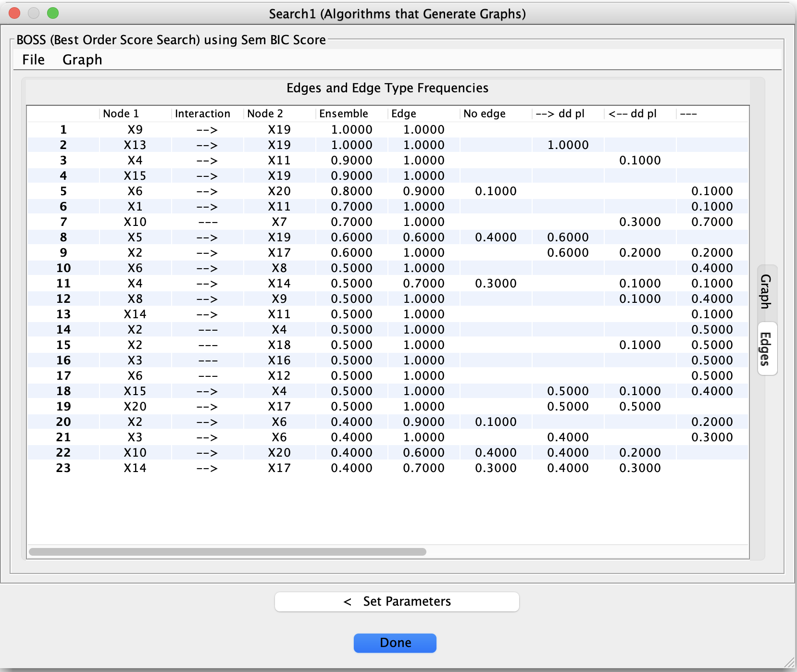

# Detail: Bootstrapping and Ensemble Graphs

Tetrad provides built-in support for **bootstrapped causal discovery**, allowing you to assess the **stability and reliability** of discovered edges and orientations.

Bootstrapping turns a single causal search into an **ensemble of searches** run on resampled versions of the data. The results are then summarized in both tabular and graphical form.

This page explains how bootstrapping works in Tetrad, how to configure it, and how to interpret the resulting ensemble outputs.

---

## What Bootstrapping Does

When bootstrapping is enabled:

1. Tetrad repeatedly resamples the dataset.
2. The selected causal discovery algorithm is run on each resampled dataset.
3. The resulting graphs are collected.
4. Tetrad produces:
    - A **summary (ensemble) graph**
    - A detailed **edge-frequency table**
    - Multiple **ensemble display options** for visualization

The goal is not to “average” graphs, but to reveal which features are **stable across resamples** and which are fragile.

---

## Enabling Bootstrapping

Bootstrapping is configured in the **Bootstrapping** section of the algorithm’s parameter panel.

Key parameters include:

### Number of Bootstraps
- Specifies how many bootstrap resamples to run.
- A value of **0** disables bootstrapping.
- Any positive value enables ensemble search.

### Percentage of Resample Size
- Controls the size of each resampled dataset (minimum 10%).
- A value of **100%** corresponds to standard bootstrap resampling.

### Sampling With Replacement
- If **Yes**, standard bootstrap sampling is used.
- If **No**, subsampling without replacement is performed.

### Include Original Dataset
- Optionally includes the original dataset as an additional “bootstrap sample.”

### Random Seed
- Allows reproducible bootstrapping when set.
- A value of **–1** disables fixed seeding.

### Number of Threads
- Controls parallel execution of bootstrap searches.

---

## Running a Bootstrapped Search

Once bootstrapping parameters are set:

1. Run the causal search as usual.
2. Tetrad executes the algorithm on each bootstrap sample.
3. A **summary graph** is produced.
4. Additional results become available in the **Edges** and **Graph** tabs.

---

## The Edges Tab: Bootstrap Frequencies

After a bootstrapped search, the **Edges** tab displays a table summarizing how often each edge (and each edge type) appeared across bootstrap samples.

Typical columns include:

- **Node 1 / Node 2**  
  The pair of variables under consideration.

- **Edge / No Edge Frequencies**  
  How often an edge was present or absent.

- **Orientation Frequencies**  
  Frequencies for different edge types (e.g., →, ←, undirected, circle endpoints, bidirected).

These frequencies help answer questions such as:

- Is this adjacency consistently present?
- Is its orientation stable or ambiguous?
- Does the data support an edge at all?

Low-frequency edges should generally be treated with caution.

---

## Ensemble Graph Display Options

In the **Graph** tab, right-clicking on the graph opens an **Ensemble Display** submenu.

Available display modes include:

- **Highest**  
  Shows the most frequently occurring edge type for each variable pair.

- **Majority**  
  Displays edges that appear in a majority of bootstrap samples.

- **Preserved**  
  Displays edges that consistently appear across samples.

- **Threshold**  
  Displays edges whose frequency exceeds a user-defined threshold.

These options allow you to visually explore trade-offs between **stability and sparsity**.

---

## How to Use Bootstrapping Effectively

Bootstrapping is most useful when:

- You want to assess **robustness** of discovered structure.
- Multiple models pass diagnostic checks (e.g., Markov checking).
- You suspect results may be sensitive to sampling variability.

Recommended practice:

- Combine bootstrapping with **Grid Search**, not isolated runs.
- Prefer edges that are stable across both parameter settings *and* bootstrap samples.
- Treat unstable orientations as tentative, even if they appear in a single “best” model.

---

## Important Caveats

- Bootstrapping does **not** validate assumptions.
- Stable edges can still be wrong if assumptions are violated.
- Unstable edges are not necessarily false—they may reflect limited data or weak effects.

Bootstrapping complements, but does not replace, careful modeling and diagnostic evaluation.

---

## Summary

Bootstrapping in Tetrad provides a principled way to:

- Assess stability of causal discoveries
- Visualize uncertainty in structure and orientation
- Move beyond single-run conclusions

Used alongside Grid Search and Markov checking, it helps turn causal discovery into a **robust, evidence-driven workflow** rather than a one-shot procedure.