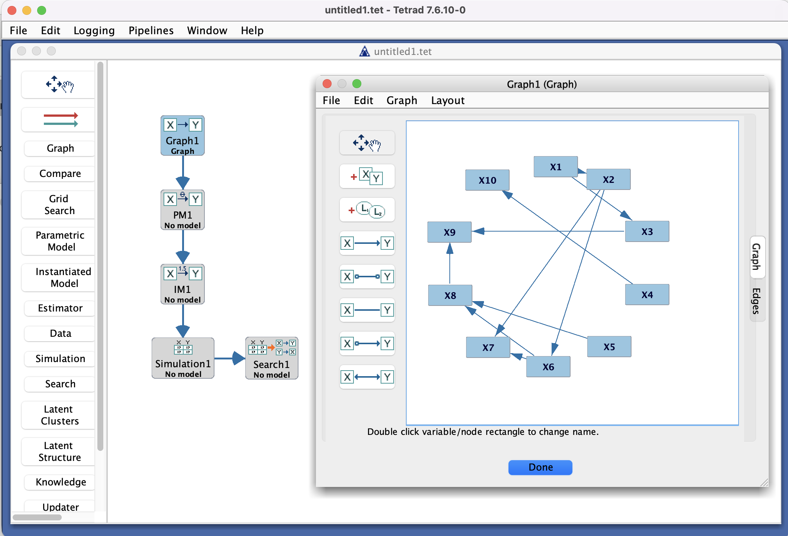

# Main Window Overview

The Tetrad main window is the starting point for most workflows. It provides:

- A **menu bar** and **toolbar** for global actions (open/save, simulate data, run algorithms, etc.).
- A **project tree** listing data sets, graphs, models, and results.
- A **work area** where editors and result views appear in tabs.
- A **status bar** with basic progress and message reporting.

[//]: # (```{note})

[//]: # (Suggested screenshot: a full view of the main window with the project tree on the left, a graph in the center,)

[//]: # (and menus/toolbar visible.)

[//]: # ()
[//]: # (Save as: ``../_static/images/tetrad-interface/main-window-overview.png``.)

[//]: # (```)



## Project tree

On the left, the **project tree** shows the objects in your current Tetrad session:

- **Data nodes** (e.g., continuous data sets, mixed data sets, covariance matrices).
- **Graph nodes** (e.g., DAGs, CPDAGs, PAGs).
- **Algorithm nodes** (search configurations).
- **Result nodes** (graphs, tables, reports created by algorithms and tools).

You can usually:

- **Double-click** a node to open it in the work area.
- **Right-click** a node to access context actions (rename, delete, export, run, etc.).
- **Drag** some nodes (such as graphs) into tools that accept them.

## Work area and tabs

The central work area displays one or more tabs:

- Graph editors
- Tables of data
- Algorithm configuration dialogs
- Result views (edge lists, parameter tables, diagnostics)

Tabs can usually be closed independently; closing a tab does **not** delete the underlying node in the project tree.

## Menus and toolbar

The **menu bar** typically includes items such as:

- **File** – open/save projects, import/export data and graphs, exit.
- **Edit** – undo/redo (where supported), basic editing commands.
- **Graph** – create new graphs, edit edges, run graph operations.
- **Search / Algorithms** – launch search algorithms and related tools.
- **Tools** – utilities such as simulation, resampling, grid search, and the Markov checker.
- **Help** – version information, links to manuals and online resources.

The **toolbar** (below the menu) exposes common shortcuts (open, save, run, layout graph, zoom in/out, etc.).
Hovering over a button usually shows a tooltip explaining its function.

## Status bar and messages

At the bottom of the main window, a status area reports:

- Running tasks (e.g., “Executing FGES…”)
- Progress indicators where available
- Warnings or errors

Long-running algorithms often update this area, and some provide **cancellable** operations from here.
