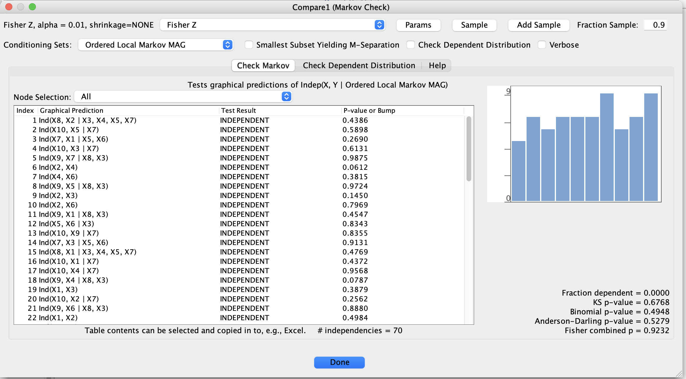

# Markov Checker

The **Markov Checker** tool helps assess whether a given graph is **Markov to a data set** (or to another graph),
i.e., whether the conditional independencies implied by the graph are consistent with what you see in the data.

[//]: # (```{note})

[//]: # (Suggested screenshot:)

[//]: # ()
[//]: # (- The Markov Checker dialog, showing selected graph and data, with a list of tested independencies.)

[//]: # (  Save as: ``../_static/images/tetrad-interface/markov-checker-dialog.png``.)

[//]: # (```)



## Purpose

Markov checking is useful when you want to:

- Evaluate whether a **candidate causal graph** is plausible for your data.
- Compare graphs learned by different algorithms or under different assumptions.
- Diagnose **mismatches** between model-implied independencies and empirical relationships.

It is especially helpful when:

- You have a **theoretical or expert-specified graph** and want to test it against observational data.
- You want to compare a true simulated graph to a graph learned from the same data.

## Basic workflow

1. Open the Markov Checker from the **Tools** or **Graph** menu.
2. Select:
    - A **graph node** to test.
    - A **data node** on which to evaluate the graph.
    - A **conditional independence test** appropriate for the data (e.g., Fisher Z, G-square, kernel CI).
3. Configure:
    - A significance level `alpha`.
    - Any additional options the test provides (e.g., maximum conditioning set size, kernel basis options).
4. Run the checker.

The tool will:

- Enumerate conditional independencies implied by the graph (or a subset, depending on options).
- Test them empirically using the chosen CI test.
- Summarize which implied independencies are **accepted** or **rejected** at the chosen alpha level.

## Outputs

Typical outputs include:

- A **table** listing:
    - Tested independence statements (e.g., \( X \perp Y \mid S \)).
    - Test statistics, degrees of freedom (if applicable), and p-values.
    - A flag indicating whether the independence is rejected at the chosen `alpha`.

Optional summaries may report:

- The fraction of implied independencies that are rejected.
- The most strongly violated conditional independencies.
- Basic diagnostics or recommendations.

## Interpreting results

- If **few or no** implied independencies are rejected, the graph is broadly **compatible** with the data (at the
  chosen alpha).
- If **many** implied independencies are rejected, the graph may be:
    - Misspecified (wrong structure),
    - Too simple (missing edges or latents),
    - Or the CI test assumptions may be badly violated.

Markov checking does **not** prove that a graph is correct; it only checks whether its independence structure is
consistent with the data to a first approximation. It is best used alongside discovery algorithms, domain knowledge,
and other diagnostics.
