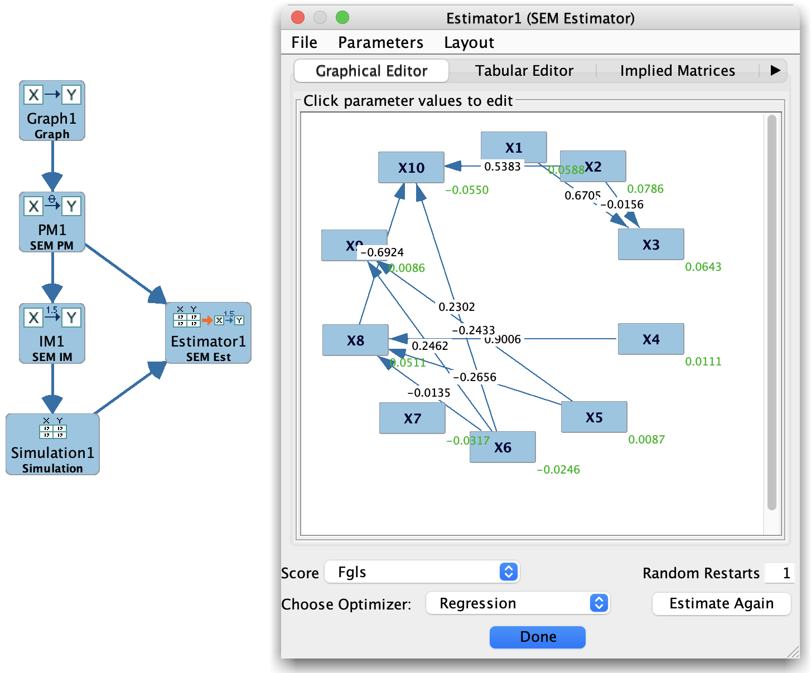

# Estimate model parameters

In many workflows, you do not just want a graph; you also want **numerical parameters**:
regression coefficients, error variances, factor loadings, or conditional probability tables.
In Tetrad, these are obtained using the **Estimator** box, often in combination with
**Parametric Model** and **Instantiated Model** boxes.

A typical pattern is:

1. Specify a **graph** that encodes the causal or measurement structure.
2. Choose a **model family** (Bayes, SEM, Hybrid, Generalized) in a Parametric Model box.
3. Attach an **Estimator** box to both the model and the data.
4. Run the Estimator to produce an **Instantiated Model** with fitted parameters and fit statistics.

## Basic workflow

1. **Prepare data**

   Make sure you have an appropriate **Data** or **Simulation** node in the project tree:
   - Continuous, discrete, or mixed, depending on the model family.
   - Cleaned and typed correctly (variable types set as needed).

2. **Specify the model structure**

   There are two common starting points:

   - **From a graph**
     Use a **Graph** box to define the structure (DAG, measurement model, etc.), then
     connect it to a **Parametric Model** box and select a model family:
       - Bayes (multinomial),
       - SEM (linear SEM),
       - Hybrid (conditional Gaussian),
       - Generalized (user-specified functions and error distributions).

   - **From an existing model family**
     If you already have a Parametric Model box configured, you can skip directly to
     connecting it to an Estimator.

3. **Attach an Estimator box**

   On the workbench:

   - Place an **Estimator** box.
   - Connect it to:
     - The **Parametric Model** (or Graph, for certain estimators that derive parameters directly from a graph), and
     - The appropriate **Data** or **Simulation** box.

   The Estimator box now knows:
   - What structure to assume (from the model),
   - What data to use for fitting parameters.

4. **Configure and run the estimator**

   Double-click the Estimator box to open its configuration dialog. There you can:

   - Choose the **estimation method** (e.g., SEM Estimator, Bayesian estimator, etc., depending on the model type).
   - Set any estimator-specific **options**:
     - Handling of missing data,
     - Optimization settings (maximum iterations, convergence criteria),
     - Regularization or constraints, where applicable.

   Click **Run** to fit the model. When estimation completes, the Estimator box typically produces:

   - An **Instantiated Model** node (with fitted parameters),
   - Optionally, **fit indices** and diagnostic tables.

## Inspecting the fitted model

Double-click the resulting **Instantiated Model** node to open it:

- For SEM models, you will see:
  - Estimated path coefficients,
  - Error variances and covariances,
  - Fit indices (e.g., chi-square, CFI, RMSEA, BIC), depending on the estimator.
- For Bayes models, you will see:
  - Conditional probability tables (CPTs) for each variable given its parents.
- For Hybrid / Generalized models, you will see:
  - The parameters appropriate to the chosen family (e.g., conditional Gaussian components,
    basis-function coefficients, or user-defined functions).

From the Instantiated Model view, you can:

- Inspect parameter values and standard errors (where provided).
- Export parameter tables for use in external software.
- Use the fitted model as input to other boxes:
  - **Simulation** (to generate new data from the fitted model),
  - **Updater** (to compute conditional distributions given evidence and interventions),
  - **Compare** (to evaluate fit or compare fitted models).

## Relationship to graphs and search

Estimating model parameters typically comes **after** you have either:

- Selected a graph structure by hand in the **Graph Editor**, or
- Learned a graph using a **Search** box (PC, FGES, GFCI, FCIT, etc.), and then
  used that learned graph as the basis for a parametric model.

A common end-to-end pipeline looks like:

1. **Data → Search → Graph**
   Learn a graph structure from data.
2. **Graph → Parametric Model → Estimator → Instantiated Model**
   Choose a model family and estimate parameters.
3. **Instantiated Model → Simulation / Updater / Compare**
   Use the fitted model for prediction, simulation, or effect estimation.

This separation—first **structure**, then **parameters**—allows you to:

- Compare multiple candidate graphs using the **same** estimation method.
- Compare multiple model families (e.g., SEM vs Hybrid) on the **same** graph.
- Re-estimate parameters on new data without changing the underlying structure.

## Where to look next

For details on specific estimators and their options, see:

- **Estimator Box** (box-by-box section),
- **Detail: SEM Estimator**,
- **Parametric Model** and **Instantiated Model** pages for each model family.