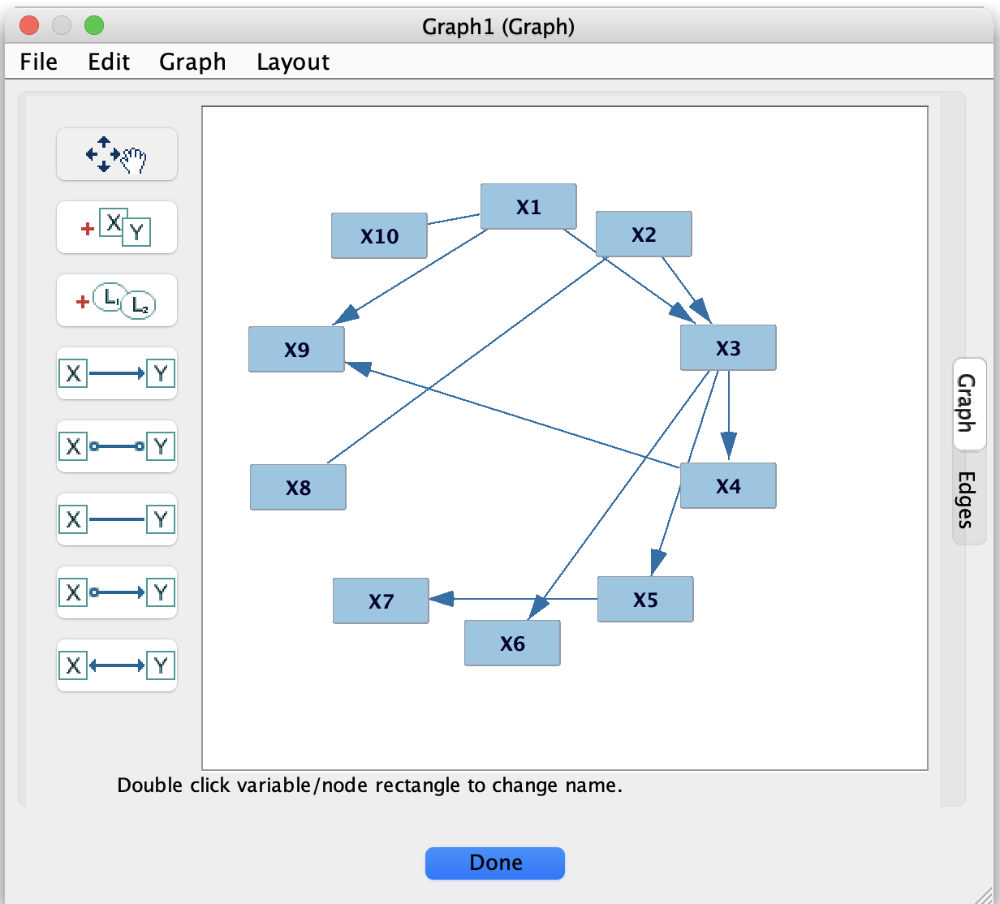

# Graph Editor

The graph editor is where you **create, inspect, and modify** causal graphs (DAGs, CPDAGs, PAGs, etc.) within Tetrad.
Most search results and many tools ultimately produce graph nodes that you can open here.

## Opening and creating graphs

You can obtain a graph in several ways:

- **From a search algorithm** – most search boxes output one or more graphs that appear as nodes in the project tree.
- **By importing** from a file (for example, a Tetrad graph `.txt` file).
- **By creating a blank graph**, using a menu item such as **Graph → New Graph** or an equivalent toolbar button.

To edit a graph, **double-click** its node in the project tree. The graph opens in a new tab in the work area.

## Basic editing operations

In the graph editor, you can:

- **Add variables (nodes)**  
  Use the appropriate toolbar button or right-click on empty space in the editor and choose an “Add node” option.
- **Rename variables**  
  Double-click the node label or use the node’s context menu to change its name.
- **Add edges**  
  Depending on the current edge tool/mode, click on a source node and then on a target node, or drag from one node to another.
- **Delete edges or nodes**  
  Select the edge or node and press Delete/Backspace, or use the context menu.

You can select multiple nodes and edges (for example, by dragging a selection rectangle) to move or delete them together.

### Edge types

The exact **edge types** available depend on the graph type:

- **Directed:** `X --> Y` (e.g., DAG or CPDAG edges).
- **Undirected:** `X --- Y` (e.g., some adjacency graphs or selection-bias edges in PAGs).
- **Partially oriented:** marks like `X o-> Y` in PAGs.
- **Bidirected:** `X <-> Y` in PAGs, often indicating latent confounding.

The editor shows these marks directly on the graph. Some edge types are not allowed for certain graph types; in those cases, the editor will restrict what you can draw or automatically adjust markings to keep the graph legal.

## Layout and visualization

The editor supports automatic layout of graphs using the **Layout** menu (or equivalent toolbar buttons). Typical actions include:

- Applying an automatic layout to spread nodes out and reduce edge crossings.
- Re-centering the graph in the view.
- Zooming in, zooming out, and fitting the graph to the window.

You can also drag nodes by hand to adjust their positions after an automatic layout, if you want a specific arrangement (for example, for a figure in a paper).

## Background knowledge and tiers

Many algorithms allow **background knowledge** that constrains which graphs are considered during search. This is typically set up through a **Knowledge** box, but it uses a graph view very similar to the graph editor (as shown in the second screenshot).

In the background-knowledge view, you can:

- Mark **forbidden edges** (edges that must not appear in the search result).
- Mark **required edges** (edges that must be present in the result).
- Assign variables to **tiers**, so that variables in one tier cannot have parents from later tiers.

These constraints are saved with the knowledge object and used by algorithms that support knowledge. The underlying graph editor behavior (adding/removing nodes and edges, moving nodes, etc.) is the same as for ordinary graphs, but the marks you make are interpreted as **constraints** rather than as a final learned graph.

## Saving and exporting graphs

Graph nodes can be:

- **Stored in the current Tetrad session**, so you can close and reopen the session with graphs intact.
- **Exported** to simple text or image formats (for example, a Tetrad graph `.txt` file or a PNG image) for use in papers or external tools.

Use the graph’s context menu or the relevant **File/Graph** menu items (such as *Export Graph* or *Save As*) to write out graphs or images. This is especially useful when you need a clean, final version of a graph for a publication or for use in another application.