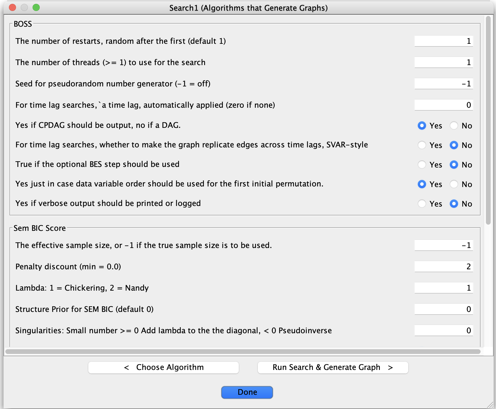

# Running Algorithms

Tetrad’s interface provides a unified way to configure and run many different **search algorithms** and related
procedures (e.g., adjustment, IDA, stability methods). Most of this happens through the **Search** box in the
main workbench.

## Launching a search

A typical workflow is:

1. Make sure you have at least one **data node** in the project tree  
   (and optionally an initial graph or background knowledge).
2. Place a **Search** box on the workbench and connect it to:
    - A **Data** box (required), and
    - Optionally a **Knowledge** box or other inputs, depending on the algorithm.
3. **Double-click** the Search node on the workbench.  
   This opens the **algorithm configuration dialog**, where you select:
    - The **algorithm** to run (PC, FGES, GFCI, CStaR, BOSS, etc.).
    - The **data set** to use (from the list of loaded data nodes).
    - A **test** and/or **score** (depending on the algorithm).
    - The **graph type** to produce (e.g., DAG, CPDAG, PAG), if configurable.
    - Any algorithm-specific **parameters**.

When you click **Run** (or the equivalent button):

- Tetrad executes the algorithm.
- One or more **result graphs** (and sometimes tables) are created as new nodes in the project tree.
- The primary result graph usually opens automatically in the graph editor.

## Choosing tests and scores

The algorithm dialog typically restricts the available **tests** and **scores** to those compatible with your data:

- For **continuous** data, choices might include:
    - *FisherZ* (independence test),
    - *SemBicScore* / Gaussian BIC (score-based methods),
    - *EBIC*, basis-function tests/scores, etc.
- For **discrete** data:
    - *GSquare* and *ChiSquare* (independence tests),
    - *DiscreteBicScore* or *BDeuScore* (scores).
- For **mixed or nonlinear** cases:
    - Conditional Gaussian tests/scores,
    - Basis-function LRT/BIC,
    - Kernel-based tests such as *Kci*, when appropriate.

The dialog lists only those tests and scores that match the **data type** of the selected data node.  
For details on individual tests and scores, see the **Tests & Scores** section of the manual.

## Setting parameters

Each algorithm exposes a set of named parameters (for example, `alpha`, `penaltyDiscount`, `maxDegree`,
or flags for latent variables and selection bias). In the configuration dialog:

- Parameters appear in a **table or form** with:
    - The **parameter name**,
    - Its **current value**, and
    - Often a brief description or default.
- Values may be:
    - Integers or real numbers,
    - Booleans (true/false),
    - Options from a small set (drop-down menus).

Defaults are chosen to be reasonable for many problems, but you can adjust them for your specific application.
The **Parameters** and **Tests & Scores** sections of the manual describe these settings in more depth.

## Running and monitoring

When you start a run:

- The **status bar** at the bottom of the main window reports that the algorithm is executing.
- Some algorithms display a **progress indicator** or a rough notion of how far they have proceeded.
- If **Logging → Start Logging** is enabled, you will see log messages in the logging pane as the algorithm runs.

When the run completes:

- New result nodes (graphs, tables, or summary reports) appear under the corresponding **Search** branch in the
  project tree.
- The main result graph typically opens immediately in the graph editor so you can inspect it.

## Re-running with modified settings

To try different settings:

1. **Double-click** the same Search node again to reopen the configuration dialog.
2. Change:
    - The test or score,
    - One or more parameter values (e.g., a different `alpha`),
    - Or options such as allowing latent variables or selection bias.
3. Click **Run** to produce a new set of results.

This makes it easy to:

- Do small **parameter sweeps** manually,
- Compare runs with and without background knowledge,
- Or evaluate the effect of changing test/score families for the same data.

For larger grids of parameter combinations, see the **Grid Search** page in this section.