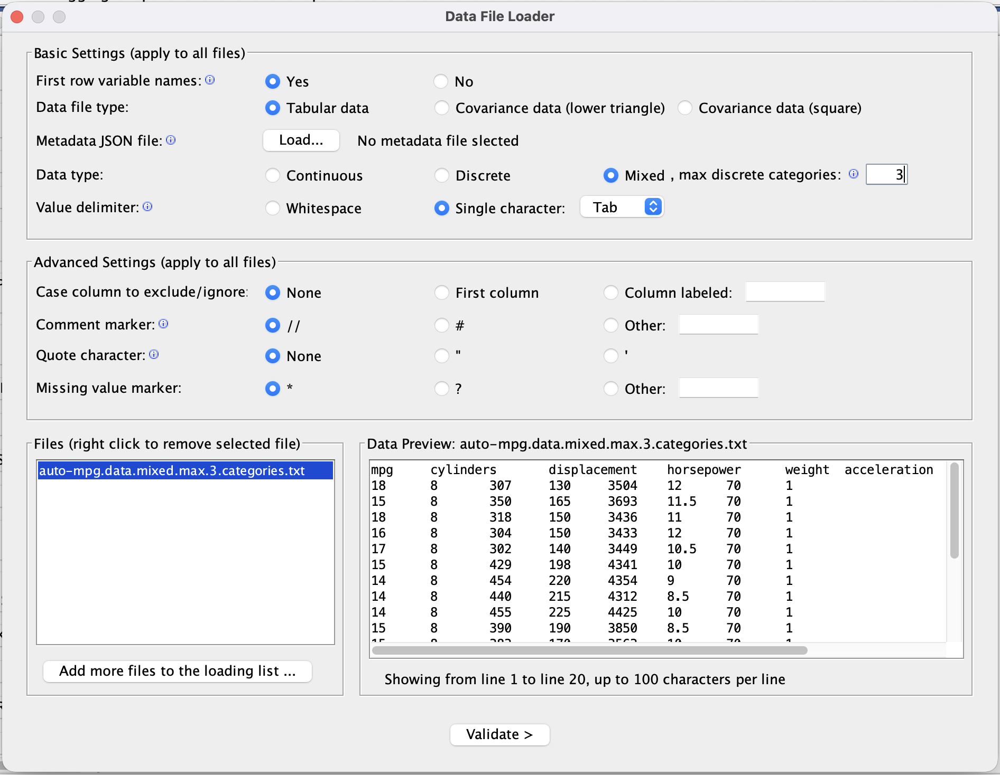

# Working with Data

Tetrad supports several ways of bringing data into the interface and organizing it for analysis.
Most workflows start by loading one or more data sets into the **project tree**.

## Importing data

A typical workflow for bringing data into Tetrad is:

1. Choose **File → Load Data**.
2. Select a file (for example, `.txt`, `.csv`, or a Tetrad-specific format).
3. In the import wizard, confirm:
    - The **delimiter** (tab, comma, etc.).
    - Whether there is a **header row** with variable names.
    - How **missing values** are encoded (for example, empty cells or a special code).
4. Review the automatically inferred **variable types** (continuous, discrete, etc.) and adjust if necessary.
5. Finish the wizard to create a **data node** in the project tree.

Tetrad distinguishes between several kinds of data nodes:

- **Raw data sets** – rectangular case-by-variable tables (rows = cases, columns = variables).
- **Covariance or correlation matrices** – used by algorithms that operate directly on summary statistics (e.g., some SEM or factor-analysis methods).
- **Mixed data** – tables where some variables are continuous and others are discrete.

The type of data node you import determines which **tests**, **scores**, and **algorithms** are available later.

## Viewing and editing data

To inspect a data set, **double-click** its node in the project tree:

- The main table shows **rows as observations** and **columns as variables**.
- A side panel (or header area) shows **metadata** such as variable names, types, and, for discrete variables, category levels.

From the data view and its context menus you can typically:

- Rename variables.
- Change variable types (for example, from continuous to discrete) when appropriate.
- Inspect basic information like the number of rows, number of columns, or presence of missing values.

Any changes you make here affect how the data set is treated by search algorithms and other tools.

## Linking data and graphs

Most search and modeling workflows require at least:

- One **data node** (continuous, discrete, or mixed), and
- A **test/score** that matches the data type (for example, FisherZ for continuous, GSquare for discrete).

When you configure a search algorithm or other tool in the GUI:

- You select which **data node** to use (often from a drop-down menu).
- Tetrad restricts the available tests and scores to those that are compatible with the chosen data type.
- The resulting graph or model is stored as a new node in the project tree, conceptually linked to the data but managed separately.

You can load multiple data sets in the same session and run different algorithms (or different configurations of the same algorithm) on each.

## Saving and exporting data

Data nodes can be:

- **Saved as part of a Tetrad session file**, so the data and all derived graphs/results can be reloaded together.
- **Exported** to a tab-delimited text format (and sometimes other formats) for use in R, Python, or other tools.

Look under the **File** menu for options to save the current session and to export data. This makes it easy to move between Tetrad and external analysis environments while keeping a record of which data sets were used for which graphs and models.