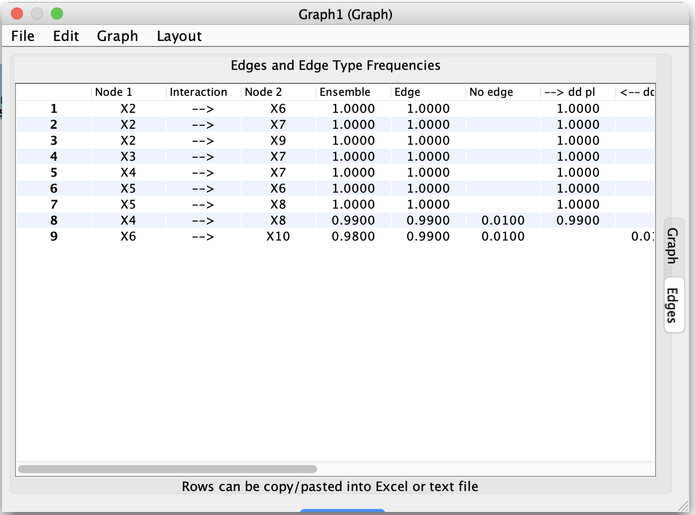

# Simulation and Utilities

In addition to search algorithms, Tetrad provides several **utility tools** that support simulation,
resampling, and model checking. Many of these are accessible from the **Tools** menu.

[//]: # (```{note})

[//]: # (Suggested screenshots:)

[//]: # ()
[//]: # (1. The dialog for simulating data from a graph.)

[//]: # (   Save as: ``../_static/images/tetrad-interface/simulate-data-dialog.png``.)

[//]: # (2. Any additional utility dialog you frequently use &#40;e.g., resampling&#41;.)

[//]: # (   Save as: ``../_static/images/tetrad-interface/utility-dialog.png``.)

[//]: # (```)




## Simulating data from a graph

A common workflow is:

1. Start from a **causal graph** (e.g., a DAG with parameterized edge coefficients or distributions).
2. Choose a menu item such as **Tools → Simulate Data from Graph**.
3. Configure:
    - Number of samples.
    - Error distributions (Gaussian, non-Gaussian, etc.).
    - Whether to add measurement error or missingness.
4. Run the simulation to produce a new **data node** in the project tree.

This is useful for:

- Benchmarking algorithms on known ground-truth graphs.
- Creating teaching examples.
- Exploring the impact of different noise models.

## Resampling and bootstrap tools

Some Tetrad tools support:

- **Bootstrap resampling** of an existing data set.
- Subsampling strategies to assess the stability of learned graphs or parameter estimates.

These tools typically:

- Take a data node and sometimes a graph or algorithm configuration as input.
- Produce collections of graphs or tables summarizing variability.
- Integrate naturally with methods like **CStaR** or **LV-Heuristic** that analyze stability or latent structure.

## Other utilities

Depending on your version of Tetrad, you may see additional tools such as:

- Data preprocessing helpers.
- Graph conversion or simplification tools.
- Checks for correctness of graph types or graph properties.

Two important tools with their own pages in this section are:

- **Grid Search** – for systematic parameter sweeps over algorithms.
- **Markov Checker** – for checking whether a graph is Markov to a data set (or another graph).

See those pages for more detailed descriptions and usage patterns.
