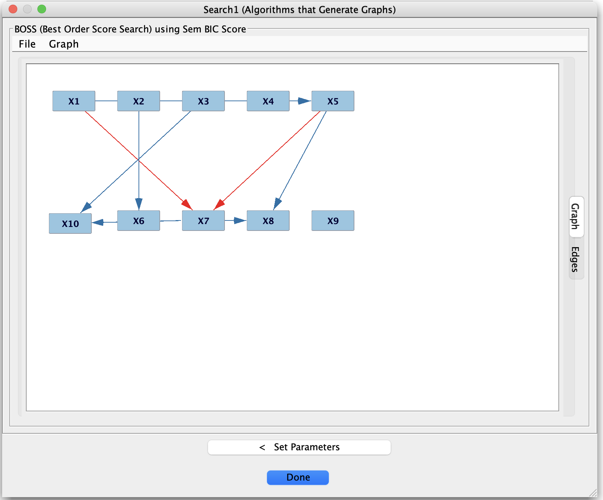
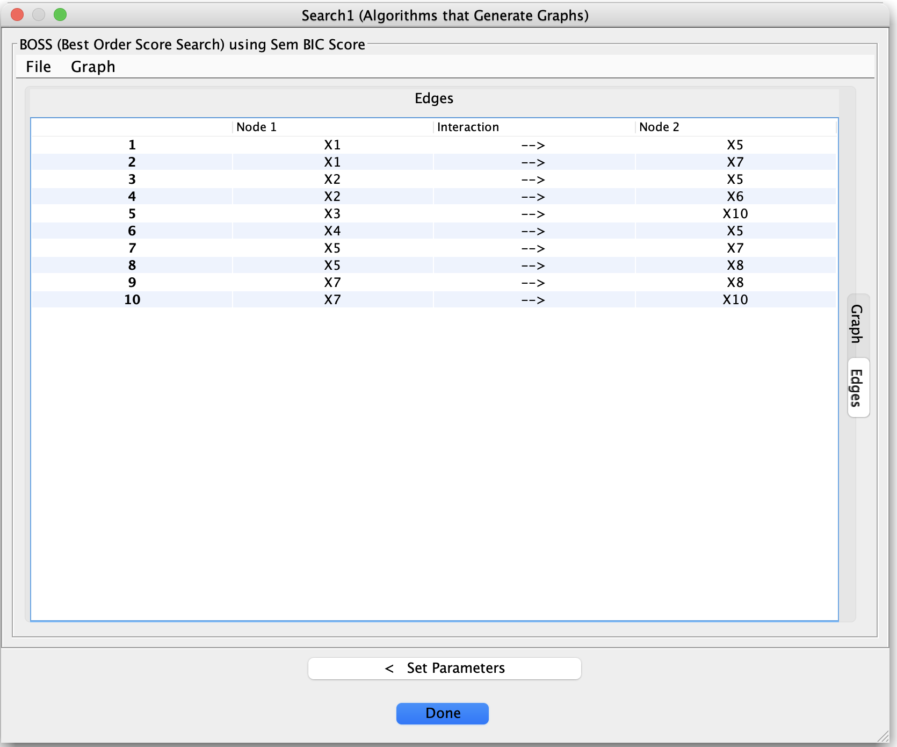

# Viewing and Exporting Results

After running algorithms or tools, Tetrad produces various **result nodes**: graphs, tables, summaries, and
diagnostic information. This page summarizes how to inspect and export those results.

[//]: # (```{note})

[//]: # (Suggested screenshots:)

[//]: # ()
[//]: # (1. A results graph with some edges highlighted or labeled.)

[//]: # (   Save as: ``../_static/images/tetrad-interface/results-graph.png``.)

[//]: # (2. A result table &#40;e.g., a list of edges with scores or p-values&#41;.)

[//]: # (   Save as: ``../_static/images/tetrad-interface/results-table.png``.)

[//]: # (```)





## Graph results

Many algorithms output one or more graphs:

- **Search graph** (DAG, CPDAG, PAG, MAG, etc.).
- **Adjacency graph** or auxiliary graphs (depending on algorithm).
- Sometimes separate graphs for **latent structure**, **selection bias**, etc.

Double-click any graph node to open it in the graph editor. You can:

- Inspect **edge orientations** and types.
- Compare graphs side-by-side (by opening multiple tabs).
- Use layout and zoom tools to make structures clearer.

## Tabular results

Some tools (e.g., CStaR, adjustment set enumerators, IDA variants) produce **tables**:

- Each row corresponds to an edge, adjustment set, or other object.
- Columns contain metrics such as:
    - p-values, scores, or stability frequencies.
    - Effect size estimates and confidence/credible intervals.
    - Information about adjustment sets or separating sets.

These tables can typically be:

- **Sorted** by clicking on column headers.
- **Filtered** using simple controls or by exporting to external tools.

## Exporting graphs and tables

Common export actions include:

- **Graphs**
    - Export to image (PNG, PDF, etc.) for papers or presentations.
    - Export to a text format compatible with Tetrad and other tools.
- **Tables**
    - Export to CSV or TSV for further analysis in R, Python, or spreadsheets.

Use right-click on the result node or the **File / Export** menu entries to find the appropriate options.

## Reusing results in pipelines

Results from one step can often be reused as inputs to another:

- Use a **learned graph** as input to an **adjustment-set finder** or **IDA** method.
- Use simulated or resampled data as input to a different search algorithm.
- Use graphs from grid search or stability procedures as starting points for more refined analysis.

The project tree’s structure encourages this style of **incremental workflow**, where you build up a collection of
data, graphs, and derived artifacts within a single session or project file.
