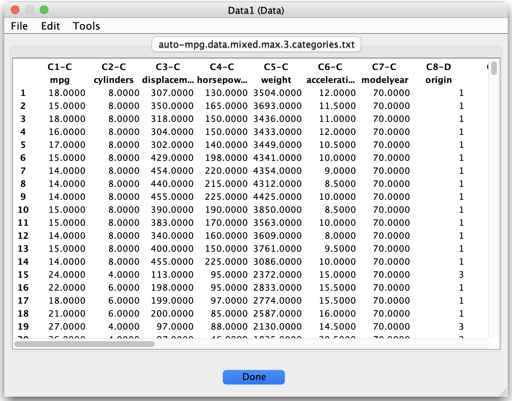

# Working with Data

Tetrad supports several ways of bringing data into the interface and organizing it for analysis.

[//]: # (```{note})

[//]: # (Suggested screenshots:)

[//]: # ()
[//]: # (1. Data import dialog with a CSV file selected.)

[//]: # (   Save as: ``../_static/images/tetrad-interface/data-import-dialog.png``.)

[//]: # (2. A data table open in the work area, with variable types visible.)

[//]: # (   Save as: ``../_static/images/tetrad-interface/data-table.png``.)

[//]: # (```)




## Importing data

Typical workflow:

1. Choose **File → Load Data** (or a similar menu item).
2. Select a file (e.g., `.txt`, `.csv`, or a Tetrad-specific format).
3. Confirm the delimiter, header row, and missing value encoding.
4. Review the automatically inferred **variable types** (continuous, discrete, etc.) and adjust if necessary.
5. Finish the wizard to create a **data node** in the project tree.

Tetrad usually distinguishes between:

- **Raw data sets** (rows = cases, columns = variables).
- **Covariance or correlation matrices** (often used for SEM or factor analysis).
- **Mixed data** where some variables are continuous and others discrete.

The type of data node you import will determine which **algorithms** and **tests/scores** are available.

## Viewing and editing data

Double-click a data node in the project tree to open it:

- The data table shows **rows as observations** and **columns as variables**.
- You can **scroll**, **sort**, and sometimes **filter** the view.
- A side panel typically shows **metadata** such as variable type, category levels (for discrete), and descriptions.

Some basic operations (e.g., renaming variables, adjusting types) may be available directly from this view or via
context menus.

## Linking data and graphs

Most search algorithms require:

- A **data node** (continuous, discrete, or mixed) and
- A choice of **test/score** consistent with the data type.

When you configure an algorithm from the GUI:

- You select which data node to use.
- Tetrad restricts the available tests/scores to those that make sense for that data type.
- The resulting graph is stored as a new node linked conceptually (but not physically) to the data.

## Saving and exporting data

Data nodes can usually be:

- **Saved in the project file** (for reopening within Tetrad).
- **Exported** to CSV or text formats for use in R, Python, or other tools.

Right-click the data node in the project tree and look for options like:

- *Export Data…*
- *Save As…*

This makes it easy to move between Tetrad and external analysis environments.
